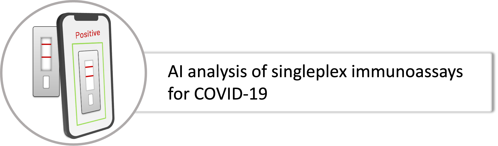

# MT-APP

This software project is composed of the following:

__Frontend__
- An app that is developed using Flutter. The app can capture the image of COVID-19 lateral flow assays and send them to the backend for analysis and storage.

__Backend__
- Based on Django REST. The backend receives the requests from the app, such as user registration and login, image submission, and databasing.
- Histogram of oriented gradients (HOG) is used to define features and  SVM is subsequently  trained and used to identify the assays.
- Once the assay is recognized, the test lines will be interpreted using CNNs.
